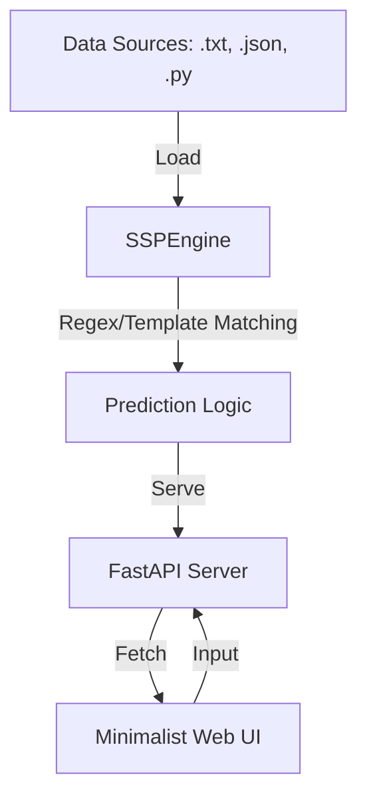

# 🧠 SimpleSP: Simple Sentence Predictor

SimpleSP is a minimalist, retrieval-based sentence prediction engine. It is designed to be **lightweight**, **local-first**, and **deterministic**, making it an ideal companion for technical writers, developers, or anyone who wants a private, fast completion assistant without the overhead of heavy AI models.


## ✨ Why SimpleSP?

- **Privacy First**: No data ever leaves your machine. Your data is your own.
- **Blazing Fast**: Retrieval is near-instant, even with thousands of sentences.
- **Zero Configuration AI**: Uses regex and template matching instead of training complex models.
- **Hot Reloading**: Automatically refreshes its knowledge base when you save your files.

## 🚀 Getting Started

### Prerequisites

- Python 3.8+
- [uv](https://github.com/astral-sh/uv) (Recommended) or `pip`

### Installation

1. **Clone the repository:**
   ```bash
   git clone https://github.com/user/SimpleSP.git
   cd SimpleSP
   ```

2. **Install dependencies:**
   ```bash
   uv pip install -r requirements.txt
   # Or using pip:
   pip install -r requirements.txt
   ```

### Usage

1. **Add your data**: Place your `.txt`, `.py`, or `.json` files in the `data/` directory.
2. **Launch SimpleSP**:
   ```bash
   uv run main.py
   ```
3. **Access the UI**: Open [http://127.0.0.1:8000](http://127.0.0.1:8000) in your browser.

## ⚙️ Configuration

You can customize SimpleSP using `config.json` in the root directory:

```json
{
    "data_dir": "data",
    "supported_extensions": [".txt", ".py", ".json"],
    "reload_check_interval": 2
}
```

## 🛠️ Architecture

SimpleSP uses a decoupled architecture for maximum flexibility:



## 🧪 Running Tests

To ensure everything is working correctly:
```bash
pytest
```

## 📜 License

Distributed under the MIT License. See `LICENSE` for more information.

---
Created by TreeSoft.